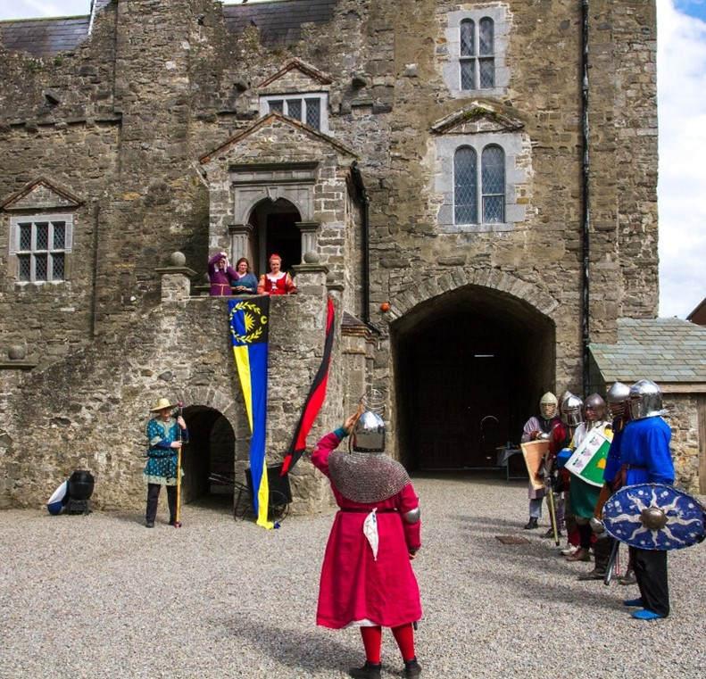
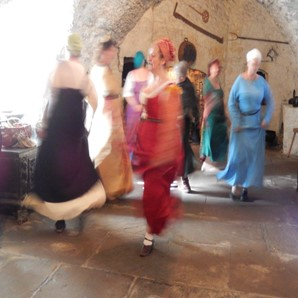
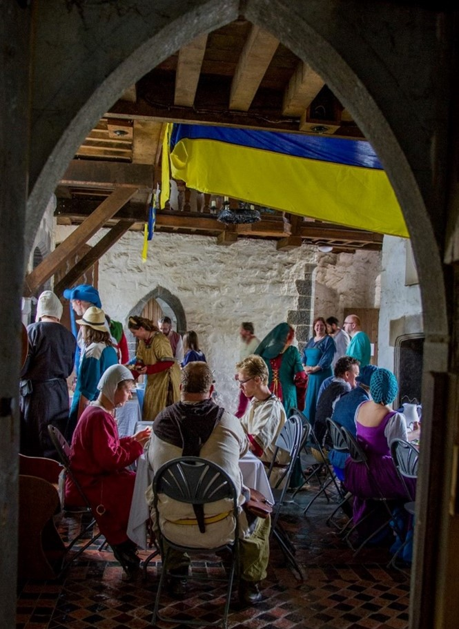

## Féile an Fhlaith - Springtime Revel

**12 April 2025**

  <a class="btn btn-warning shadow m-2 w-50" href="https://fienta.com/springtimerevel"><i class="fas fa-ticket-alt me-1 m"></i> Book here</a> 

Dun in Mara invites you to Drimnagh Castle on Saturday 12th of April for a very special one-day event. We will have this wonderful, moated, 13th century Norman castle to ourselves from 10:30 to 17:30.

Join us for thrown weapons in the garden, attending court with the princess of the land, trying your hand at a medieval craft, enjoying bardic activities, and getting to know new friends over a shared meal.

**Pre-booking is essential.** 

We regret that this site is not wheelchair accessible due to a gravelled courtyard and tight/steep stairs.

<table align="center">
<tr>
<td></td>
<td></td>
</tr>
</table>

### Planned Activities

We will be throwing knives and axes in the garden. Our artisans will bring medieval crafts to teach. Some examples of their skills include calligraphy, spinning wool, weaving, bookbinding, sewing, and more.  
We will have medieval games to play and songbooks to inspire your bardic performances. Our princess of Insulae Draconis will host court.  
And, we will share a meal together in the castle’s hall.  
Specific details and a schedule of activities will be announced closer to the event.  
If you, or your friends or family, are curious about what we do in the SCA, but are apprehensive about attending a longer event, this is an ideal time to come along and have a look! We will be wearing medieval clothing (garb), but don’t worry if you don’t have anything that looks historical. We are happy to lend you clothing for the day if you let us know on the booking form. 

<table align="center">
<tr>
<td></td>
<td></td>
</tr>
</table>

### Costs

€10 — First time attending an SCA event  
€25 — Adults   
€10 — Children (up to 12 years old)  

### Food

Our feast for the day will be a potluck (everybody brings something to contribute). Don’t stress about this! You only need to bring enough to feed yourself and a bit extra. If you do want to bring food that might have been seen in the medieval age, here are a few ideas:  
•	Avoid potatoes, tomatoes, sweetcorn, pumpkins, and chillis. These are New World foods.  
•	Bread is always welcome (ideally loaves, not sliced pan). Bread rolls are great!  
•	Cold meats and cheeses are excellent.  
•	Fruits (fresh or dried) and pickles of any kind (from fish to gherkins) are welcome on any feast table.  
•	German-style sausages are ideal. Spanish sausages tend to have tomato and/or chilli in them, so we typically avoid them for events.  
•	Boiled eggs and pies are good.  
•	Baklava isn’t quite period, but there are very similar period desserts so we welcome it with open arms!  
•	Halwa, barfi, and almost all Middle Eastern sweet things are great!  

<table align="center">
<tr>
<td></td>
<td></td>
</tr>
</table>

### Staff

Event Stewards: Alays de Lunel (Claudia Barron) & Gertrude Hood (Katie McMahon)  
Marshal-in-charge : Aodhan dha Cheist (Aidan Barron)  

### Directions

From Dublin City Centre: Take the road from Dame Street to Patrick Street, turn right onto Cork Street. Continue on up Cork Street and onto Crumlin Road. When on the Long Mile Road turn right before Aldi and Drimnagh Castle is the second gate on the left.  
From the M50: Take the Junction 9 exit and continue onto the Long Mile Road until you get to Drimnagh Castle Secondary School, turn in at second gate.  
Bus Routes: S4, 151, 56A  
GPS Coordinates: Latitude: 53.323921 Longtitude: -6.332433  
Parking is available on site.  

  <a class="btn btn-warning shadow m-2 w-50" href="https://fienta.com/springtimerevel"><i class="fas fa-ticket-alt me-1 m"></i> Book here</a> 

