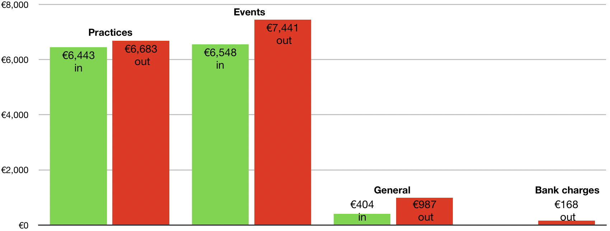
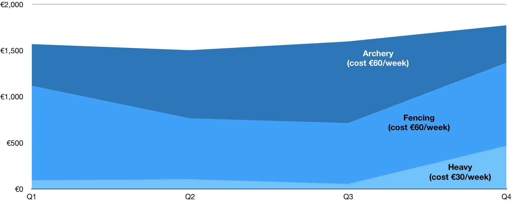
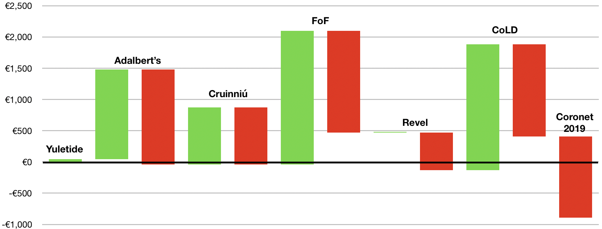

This is an attempt to make our spending for the shire as transparent as possible, in addition to giving our officers the tools to better plan for the upcoming year.

The spend on Weekly practices is somewhat fragmentary due to how the venues were paid but is still representative when seen as totals for the year. General outgoings included things like gear for Fencing and Archery as well as some kitchen equipment.

From the graphs we can clearly see that we plan our events very well often making a modest surplus. This is channelled back into hosting revels, which are currently free to attend, and going towards the deficit from holding the weekly practices.

During 2018, we can see that Fencing made a modest surplus. We will need to carefully watch our attendance on all the practices as the expenditure for space is significant. Perhaps it would be possible for the various martial communities to organize fund raising to help us support them, especially if we intend to increase the space we will be renting in the future.

Overall, the shire would have shown a small surplus if we had not had the significant cost of the €1,300 deposit for the venue for 2019’s Coronet of Fools going out in 2018.

I would recommend that we consider carefully how much of a balance we need to hold in our accounts in order to be able to pay for weekly practices and take that as our benchmark when organising events in the future.

Members who would like further details may request them from the Exchequer: [exchequer@duninmara.org](mailto:exchequer@duninmara.org).

Outgoings vs. Income
--------------------

| |Outgoings|Income|
|---|---|---|
| Practices	| -€6683.00	| €6443.00 |
| Events	| -€7441.25	| €6548.15 |
| General	| -€986.69	| €404.00 |
| Bank charges	| -€167.88	| |
|---|---|---|
| **Total**	| **-€15278.82**	| **€13395.15** |
| **Deficit** | **-€1883.67** | |

 

Weekly Practices
----------------

|Practices	|Heavy in|Heavy out		|Fencing in|Fencing out		|Archery in|Archery out
|---|---|---|
|Q1	|€94.00|	€0.00|€1025.00	|-€720.00	|€450.00	|-€600.00|
|Q2	|€105.00|		€0.00|€660.00	|-€660.00	|€738.00	|-€780.00|
|Q3	|€54.00	|-€608.00	|€660.00	|-€660.00	|€884.00	|-€780.00
|Q4	|€467.00	|-€352.00	|€900.00	|-€923.00	|€406.00	|-€600.00
|**Totals**|**€720.00**	|**-€960.00**	|**€3245.00**	|**-€2963.00**	|**€2478.00**	|**-€2760.00**
|Surplus/Deficit|-€240.00|		|€282.00|		|-€282.00	|

 

|Overall figures| |
|---|---|
|Overall Cost of Practices|€6,683.00|
|Overall Income from Practices|€6,443.00|
|**Overall Deficit from Practices**|**-€240.00**|

 

Events
------

|Event|Income|Expenditure|Surplus/Deficit|
|---|---|---|
|Yuletide University 2017|€43.15|€0.00|€43.15|
|St. Adalbert's|€1,435.00|-€1,520.00|-€85.00|
|Cruinniú|€915.00|-€916.24|-€1.24|
|Festival of Fools|€2,140.00|-€1,628.53|€511.57|
|Drimnagh Revel|€0.00|-€600.00|-€600.00|
|CoLD|€2,015.00|-€1,476.48|€538.52|
|Coronet 2019|€0.00|-€1,300.00|-€1,300.00|
|**Totals**|**€6,548.15**|**-€7,441.25**|**-€893.10**|