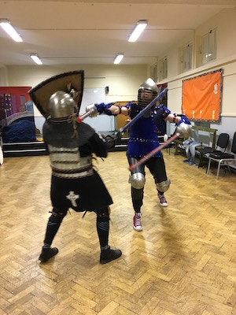

Armoured combat, or “heavy combat”, in the SCA is a modern interpretation of the Medieval arts of tournaments and war. We use rattan weapons instead of steel, but as this form of combat is a full contact activity, we wear protective armour. The standards of armour and weaponry are strictly dictated by our rules. Official training sessions, as well as competitions, are supervised by trained people known as marshals.

Armoured combat is practiced by people of all genders and we welcome everyone. We not only train together, but also compete against each other, rather than segregating the combatants according to gender. A great deal of skill in armoured combat in the SCA lies in technique rather than in strength or size.

The most typical weapon form is the sword-and-shield, but many also like to use two-handed weapons, such as poleaxes or greatswords. A beginner would usually start to train with a sword and shield, and move on to other forms as interest and skill allow.

An essential aspect of armoured combat in the SCA is the ideal of courtesy: respectful behaviour towards your opponent, the marshals, the audience, as well as yourself. The combat relies on the concept of honour: if you strike a blow at your opponent, it is up to him or her, rather than to a referee, to decide whether the blow is “good” – solid enough that it would have done damage if dealt in a real battle situation. Similarly, if a blow is dealt on you, you are expected to verbally acknowledge it. Of course, any abuse of this would get a fighter swiftly into trouble!

Our day and weekend events typically include armoured combat tourneys of various kinds. Before you are allowed to enter tourneys, you must pass a safety test, “authorisation”, in order for prove that you are able to fight in a manner that is safe for yourself and for your opponents. In addition to one-to-one tourneys, we also often have melee tourneys, in which fighting is done in pairs or in groups.

**Come train with us!**

[Scoil Sancta Maria, Synge Street](https://goo.gl/maps/WHAurpDwDMR2) every Thursday at 7-9:30 pm.

Cost:  
€10 for non-members (€6 student/unwaged)  
€8 for members (€5 student/unwaged). [Join SCA UK & Ireland](https://membermojo.co.uk/scauk)

If it's your first time attending, there's no charge.

You must be over 16.

What to bring: Clothing that allows you to move easily and training shoes such as runners. Bringing water to drink is a good idea.

Weekly training sessions include movement and technique drills against pells or opponents. Most of the training can be done unarmoured. At the end of a session, those in armour put the training into practice, and those out of armour are welcome to watch and learn. All training sessions are suited to all levels and complete beginners are always welcome.

Contact: Agnes des Illes at [knightmarshal@duninmara.org](mailto:knightmarshal@duninmara.org)
