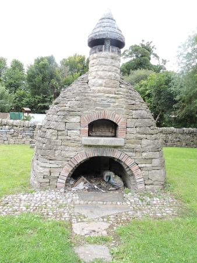

On the 19th of May, the Shire of Dun in Mara invites you for a day of mirth and merriment at Drimnagh Castle, with an evening of Tavern entertainments.  While the daylight holds there will be opportunity to train in the art of swordplay, or for those of a less martial persuasion, to practice diverse arts such as dancing and stitching.  Afterwards, join us in the Tavern for an evening of feasting, singing, toasting our health, games and battles of wit, and miscellaneous merrymaking by candlelight.

**BOOKING IS ESSENTIAL.** Please see below for booking information.

We regret that the site is not wheelchair friendly due to a gravelled courtyard and tight/steep stairs.

## Planned Activities

**[TBC]**

If you have friends or relatives who are curious about what we do, but don’t want to commit to a full event, this is an ideal time for them to come along and have a look! 
Garb (medieval clothing) is required, but don’t worry if you haven’t got anything that looks medieval – just let us know during your booking! We can lend you something for the day if need be.

## Costs & Food

We are not charging any entry fee to the Tavern. Donations (there'll be a box or a jar) are very welcome, but we're much more interested in your presence than your money.

We will be operating a pot-luck for lunch and dinner. If you can bring something, please do. If you're not sure what kind of food to bring, contact Aodh at aodhosiadhail@gmail.com and he'll give you some guidelines.

## Booking
 
Booking has closed

## Event Staff

**Event Steward:** Aodh O Siadhail

## Directions
 
**From Dublin City Centre:** Take the road from Dame Street to Patrick Street, turn right onto Cork Street. Continue on up Cork Street and onto Crumlin Road. When on the Long Mile Road turn right before Aldi and Drimnagh Castle is the second gate on the left.
 
**From the M50:** Take the Junction 9 exit and continue onto the Long Mile Road until you get to Drimnagh Castle Secondary School, turn in at second gate.
 
**Dublin Bus Routes:** 18, 151, 56
 
**GPS Coordinates:**  Latitude:  53.323921   Longtitude: -6.332433

Parking is available on site.

<iframe src="https://www.google.com/maps/d/embed?mid=1jYQYoQI7Gm1QhIckb1MvSIP-548&z=16" width="640" height="480"></iframe>