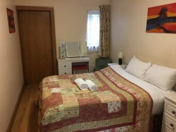
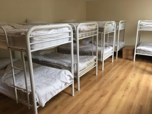
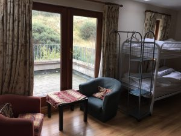

Newgrange Lodge provides a mix of dorm accommodations, B&B-style rooms, and camping. For pricing information please see [the registration page](/events/2019/coronet/registration/).

### B&B style rooms

The site provides a variety of double, twin and family rooms. Two of the rooms are wheelchair accessible on the ground floor. All rooms are en suite. In these rooms, bedding and towels are provided.

### Bunks

Newgrange Lodge has several rooms with comfortable bunk beds, which are available at a cheaper price than the B&B rooms.

Each dorm has an en suite toilet/shower. In the larger dorms, the shower room is separate. In dorm rooms, bedding is provided; please bring your own towel.

Please note that both B&B rooms and dorms must be cleared by 11:00 on Sunday 12th May.

### Camping

Camping is allowed on site.

### Staying offsite

The nearest guesthouse is [Daly's Inn](http://dalysofdonore.com) in Donore, 2km from the event site.