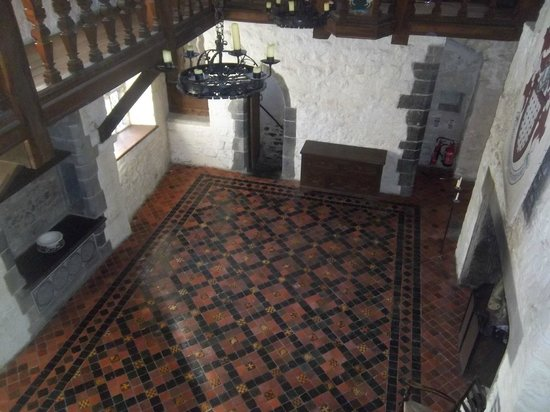

We sometimes use Drimnagh Castle for our single day events. It is in Dublin, and very easily reachable from the city centre. There is no accommodation on site.

We regret that the site is not wheelchair friendly due to a gravelled courtyard and tight/steep stairs.

## Directions

**From Dublin City Centre:** Take the road from Dame Street to Patrick Street, turn right onto Cork Street. Continue on up Cork Street and onto Crumlin Road. When on the Long Mile Road turn right before Aldi and Drimnagh Castle is the second gate on the left.
 
**From the M50:** Take the Junction 9 exit and continue onto the Long Mile Road until you get to Drimnagh Castle Secondary School, turn in at second gate.
 
**Dublin Bus Routes:** 18, 151, 56
 
**GPS Coordinates:**  Latitude:  53.323921   Longtitude: -6.332433

Parking is available on site.

<iframe src="https://www.google.com/maps/d/embed?mid=1jYQYoQI7Gm1QhIckb1MvSIP-548&z=16" width="640" height="480"></iframe>
