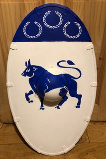

Yesterday at armoured practice we had Cernac and myself in armour, and Aodh, Jasper and Gytha out of armour. I was not able to convince the others that squats and push-ups were valid warm-up moves. Gytha and Aodh preferred slow work instead, which involved a lot of giggling and that's always a good thing. 

Myself and Cernac did a few bouts to get the need out of our system, starting half to 3/4 speed and building up to full casual speed. Afterwards we discussed what had worked well and what had worked less well. 

We talked a little bit about blow mechanics and letting the sword to have its own momentum and life, and different interpretations on where power comes from. 

Finally, Aodh and I, and Gytha and Jasper, continued slow work in pairs, enjoying the extra time of the extended practice now available, first in the hall and then in the wide corridor, as Cernac led the HEMA folks to their practice with the awesome looking polearms. I got a chance to play around with the Lough Devnaree champion's shield for the first time and found that I enjoyed it far more than I was expecting. The oval was a new shape to me and it was great to be able to try out something different.