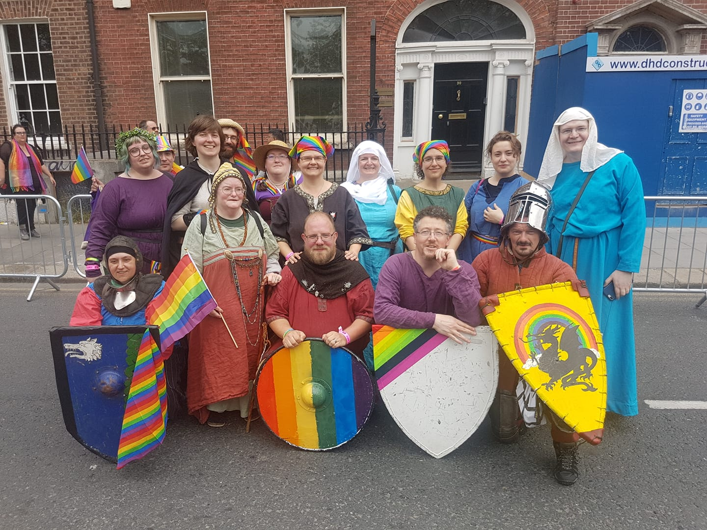

An idea for the shire to participate in the Dublin Pride parade was mooted some time last winter, and Aodh set about liaising with the organisers, but we only got the green light a couple of months ago. I had suggested combining such a march with a demo-like revel, and Sela volunteered to organise a pub room for the purpose. Next was the time to start drumming up participants for both, and we were pleased that we ended up with good numbers. We had 17 people marching in the parade, representing Dun In Mara, Eplaheimr, Glen Rathlin and Harpelstane - Roxanne flew from Edinburgh specially for the occasion. (The planned representative from Polderslot is still recovering from her traffic accident).

We didn't have the capacity to make a big banner or to really coordinate attire or props, but we plan to do better next year. We had leaflets, and we handed them out to people who looked like they had the glimmer of interest in their eye. I had intended to march in armour, but I feared the warm muggy weather might not be good for me, but thankfully Jasper and Hilkka are more resistant and had donned theirs. They, and Aodh and Mícheál, decorated their shields with rainbows.

We marched among the other "community groups" from the top of O'Connell Street to Merrion Square via the quays. That was an awful lot of people along the way, and it had a go at putting the fear even into people who otherwise enjoy being on stage. But people cheered, and took pictures, and took pictures with us, and Sela leafleted the city's Lord Mayor (narrowly missing the Taoiseach, or Prime Minister).

We rested in the Merrion Square park for a few hours before moving on to the pub, which was a beautiful room with views over the Liffey and very friendly efficient staff. We were joined by Lady Beatrix and Sir Hartmann visiting from Nordmark, and many fellow shire members, friends, and friends of friends, including many young people in their teens and early twenties.

It was all a resounding success: we set out to do outreach, for sure, but we ended up with great community building, so that we now can match more faces with names and potential interests. And the most important thing to me was one of our new fighters telling me at the end of the evening that they had not expected that they didn't need to wear a facade at our practices and gatherings: that they could be themselves, and be accepted and taken seriously.

And that, to me, is what I fight for, on many levels.

Thank you to Aodh and Sela for doing all the heavy lifting for the occasion, and Jasper, Micheal, Hilkka, Roxanne, Caitriona, Melodi, Nina, Sara, Genevieve, Timothy & Sean, Lisa, Terri & Michael for coming along for the march, and to everyone else who came to say hello in the pub.

_You can read more on the Drachenwald site about [why we marched at Pride](http://www.drachenwald.sca.org/posts/news/2019/07/02/dublin-pride/)._